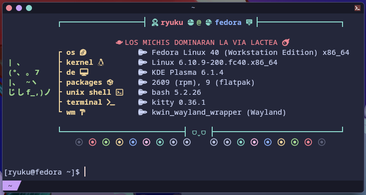

# galactic-fastfetch
A fastfetch theme for the lovers of Galactic Adventures and the wonderful fumos of touhou.
## 📷 preview images

  
preview images ✨

<i>Default:</i>
 

 

 

 

# Steps for fastfetch config
1. Install 'fastfetch' in your distribution
2. Generate config file by using command - $ fastfetch --gen-config
3. Install Nerd Fonts and change the Terminal Font to the installed Nerd Font of your liking. I use Meslo.
4. Locate your fastfetch config folder and copy the files of this repo into that folder. Replace the previous config.jsonc with mine.

# remembering:
don't forget to change the user ("source": "$(find \"/home/USER/.config/fastfetch/\" -name \"*.png\" | sort -R | head -1)") of the config for cirno.png to work

# extra:
Don't forget to change the Arch Linux logo with the distribution you are using
