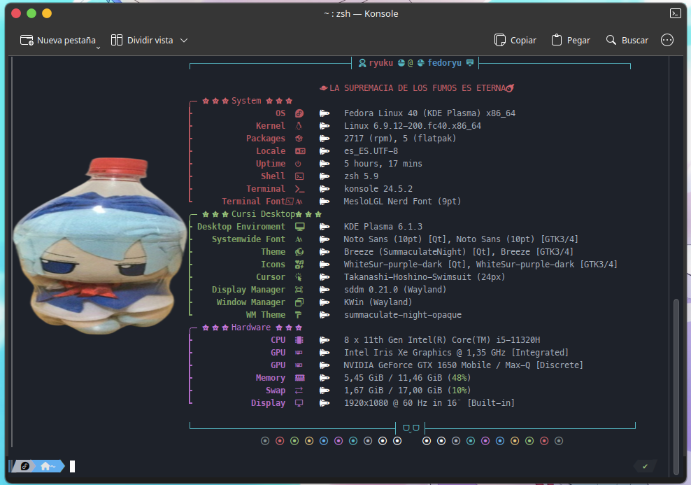

# galactic-fastfetch
A fastfetch theme for the lovers of Galactic Adventures and the wonderful fumos of touhou.
# Screenshots

# Steps for fastfetch config
1. Install 'fastfetch' in your distribution
2. Generate config file by using command - $ fastfetch --gen-config
3. Install Nerd Fonts and change the Terminal Font to the installed Nerd Font of your liking. I use Meslo myself.
4. Locate your fastfetch config folder and copy the files of this repo into that folder. Replace the previous config.jsonc with mine.

# For Other OS / DE / WM :
1. "source": "$(find \"${XDG_CONFIG_HOME:-$HOME/.config}/fastfetch/pngs/\" -name \"*.png\" | sort -R | head -1)" change the line based on your directory to load the .png images.
